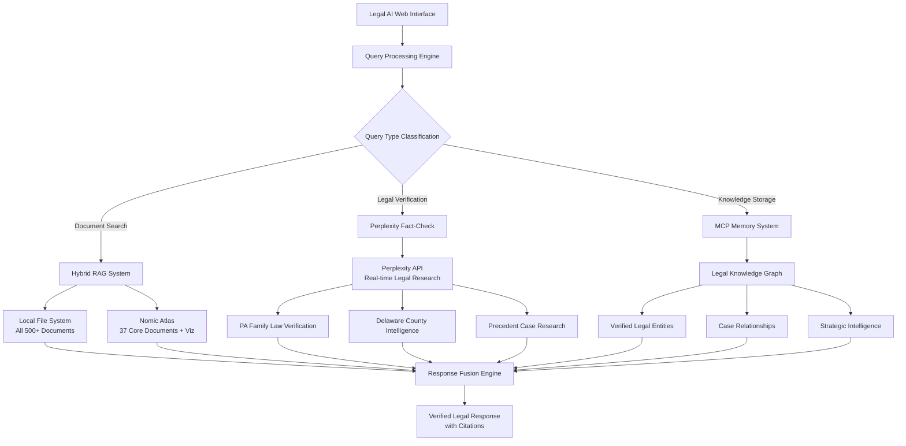
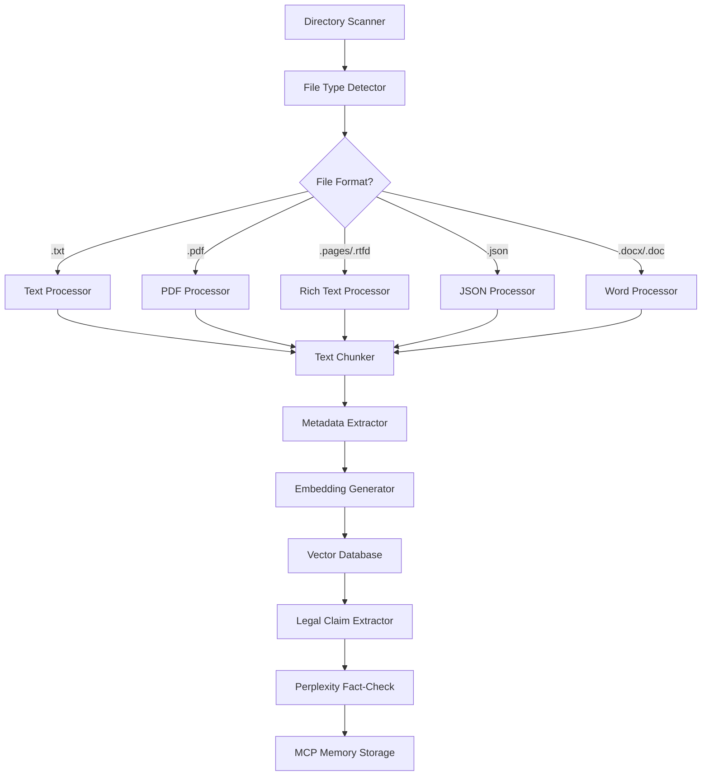
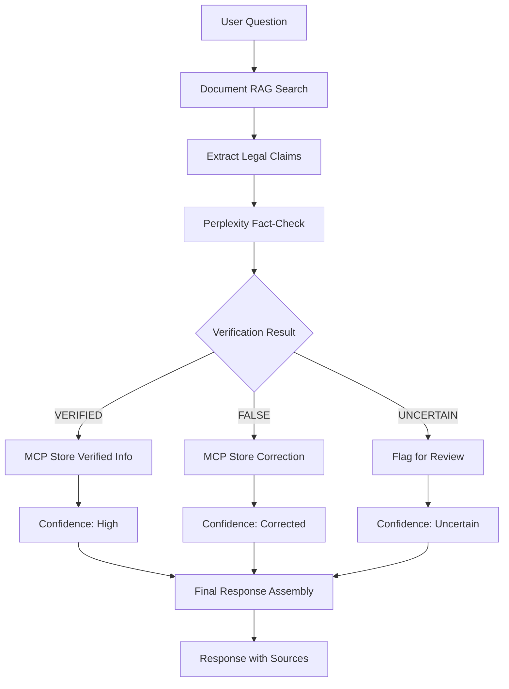

# Advanced Legal AI System - Implementation Plan

## 🎯 Project Overview

**Objective**: Expand from 37 documents in Nomic Atlas to ALL legal documents in `/Users/homebase/Desktop/1R-MASTER/DIV-5` with advanced fact-checking, semantic search, and pro se protection features.

**Critical Requirements**:
- Process 500+ documents across all directories and file formats
- Real-time legal fact-checking via Perplexity API
- Delaware County, PA family court strategic intelligence 
- Protection against misinformation in user's own documents
- Maintain existing Nomic Atlas visualizations
- Advanced semantic and embedding capabilities

## 🏗️ System Architecture

### Hybrid Architecture Overview



### Document Processing Pipeline



### Legal Verification Workflow



## 🔧 Technical Implementation

### Phase 1: Foundation Setup (Days 1-2)

#### 1.1 Perplexity API Integration
```python
class PerplexityLegalEngine:
    def __init__(self):
        self.api_key = "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"
        self.base_url = "https://api.perplexity.ai"
        self.cost_tracker = {"total_spent": 0, "queries_made": 0}
    
    def verify_legal_doctrine(self, doctrine_name):
        """Verify if a legal doctrine actually exists in PA law"""
        prompt = f"""
        LEGAL VERIFICATION REQUEST - Pennsylvania Family Law:
        
        Does "{doctrine_name}" exist as a recognized legal doctrine in Pennsylvania divorce/family law?
        
        Please provide:
        1. TRUE/FALSE determination
        2. If FALSE: Explain why it doesn't exist
        3. If TRUE: Provide statute citations and case law
        4. Alternative legal concepts that might be confused with this
        5. Current 2024-2025 Pennsylvania law on related topics
        
        Source requirements: Official PA statutes, court rules, and authoritative case law only.
        """
        return self.query_perplexity_with_cost_tracking(prompt)
    
    def research_delaware_county_strategy(self, case_type, issue):
        """Get Delaware County specific strategic intelligence"""
        prompt = f"""
        Delaware County, Pennsylvania Family Court Strategy Research:
        
        Case Type: {case_type}
        Issue: {issue}
        
        Please provide:
        1. Delaware County local court rules and procedures
        2. Judicial preferences and tendencies in family court
        3. Strategic considerations specific to this jurisdiction
        4. Recent procedural changes or local practices
        5. Success factors for pro se litigants in Delaware County
        
        Focus on practical, actionable intelligence for 2024-2025.
        """
        return self.query_perplexity_with_cost_tracking(prompt)
```

#### 1.2 MCP Memory Knowledge Graph Setup
```python
# Legal Entities for MCP Memory
legal_entities = [
    {
        "name": "Helen Haney Lafferty",
        "entityType": "OpposingCounsel", 
        "observations": [
            "Attorney at Klehr Harrison law firm",
            "Filed Entry of Appearance on June 24, 2025",
            "Represents plaintiff Melissa in divorce case",
            "Transitioned from Weber Gallagher representation"
        ]
    },
    {
        "name": "Financial Abandonment Doctrine",
        "entityType": "LegalMisinformation",
        "observations": [
            "VERIFIED FALSE by Perplexity API - No such doctrine exists in PA",
            "Appears incorrectly in user documents",
            "Correct legal standard: 23 Pa.C.S. § 3301(a)(1) abandonment",
            "Must be corrected in any legal strategy"
        ]
    },
    {
        "name": "Delaware County Family Court",
        "entityType": "Jurisdiction",
        "observations": [
            "Prefers settlement-oriented approaches",
            "Structured case management system",
            "Male defendants may face unconscious bias per user analysis",
            "Weber Gallagher shows stronger local specialization than Klehr Harrison"
        ]
    }
]

# Legal Relationships
legal_relations = [
    {
        "from": "Helen Haney Lafferty",
        "to": "Klehr Harrison", 
        "relationType": "worksAt"
    },
    {
        "from": "Melissa Bemer",
        "to": "Helen Haney Lafferty",
        "relationType": "representedBy"
    },
    {
        "from": "Financial Abandonment Doctrine",
        "to": "Pennsylvania Family Law",
        "relationType": "contradicts"
    }
]
```

#### 1.3 Enhanced Document Processing
```python
class ComprehensiveDocumentProcessor:
    def __init__(self):
        self.supported_formats = ['.txt', '.pdf', '.pages', '.rtfd', '.json', '.docx']
        self.legal_claim_patterns = [
            r'abandonment doctrine',
            r'precedent.*v\.\s*\w+',
            r'\d+\s+Pa\.C\.S\.\s*§\s*\d+',
            r'Pa\.R\.C\.P\.\s*\d+'
        ]
    
    def process_all_directories(self, base_path="/Users/homebase/Desktop/1R-MASTER/DIV-5"):
        """Process every file in every directory"""
        processed_docs = []
        
        for root, dirs, files in os.walk(base_path):
            for file in files:
                if any(file.endswith(ext) for ext in self.supported_formats):
                    file_path = os.path.join(root, file)
                    doc_data = self.process_single_file(file_path)
                    if doc_data:
                        processed_docs.append(doc_data)
        
        return processed_docs
    
    def extract_legal_claims(self, text):
        """Extract potential legal claims for fact-checking"""
        claims = []
        for pattern in self.legal_claim_patterns:
            matches = re.findall(pattern, text, re.IGNORECASE)
            claims.extend(matches)
        return claims
```

### Phase 2: Advanced Intelligence (Days 3-4)

#### 2.1 Hybrid RAG System
```python
class AdvancedHybridRAGSystem:
    def __init__(self):
        self.local_engine = LocalRAGEngine()      # All documents
        self.atlas_engine = AtlasRAGEngine()      # 37 documents + viz
        self.perplexity_engine = PerplexityLegalEngine()
        self.mcp_memory = MCPMemoryInterface()
        self.query_router = QueryRouter()
    
    def search(self, query, mode="hybrid"):
        """Main search interface with multiple modes"""
        if mode == "local":
            return self.local_engine.search(query)
        elif mode == "atlas":
            return self.atlas_engine.search(query)
        elif mode == "hybrid":
            return self.hybrid_search(query)
        elif mode == "verify":
            return self.legal_verification_search(query)
    
    def hybrid_search(self, query):
        """Combine local, Atlas, and Perplexity results"""
        local_results = self.local_engine.search(query)
        atlas_results = self.atlas_engine.search(query)
        
        # Extract legal claims for verification
        claims = self.extract_legal_claims_from_results(local_results + atlas_results)
        
        # Fact-check critical claims
        verified_claims = []
        for claim in claims:
            verification = self.perplexity_engine.verify_legal_claim(claim)
            verified_claims.append(verification)
            
            # Store in MCP Memory
            self.mcp_memory.store_verification(claim, verification)
        
        return self.fuse_results(local_results, atlas_results, verified_claims)
```

#### 2.2 Pro Se Protection System
```python
class ProSeProtectionEngine:
    def __init__(self):
        self.misinformation_detector = MisinformationDetector()
        self.perplexity_engine = PerplexityLegalEngine()
        self.confidence_scorer = ConfidenceScorer()
    
    def analyze_user_documents(self, document_text):
        """Scan user documents for potential misinformation"""
        claims = self.extract_legal_claims(document_text)
        
        verified_claims = []
        for claim in claims:
            verification = self.perplexity_engine.verify_legal_claim(claim)
            confidence = self.confidence_scorer.score(verification)
            
            verified_claims.append({
                'original_claim': claim,
                'verification': verification,
                'confidence': confidence,
                'needs_correction': verification.get('is_false', False)
            })
        
        return verified_claims
    
    def generate_protection_warnings(self, verified_claims):
        """Generate warnings for pro se litigant"""
        warnings = []
        for claim in verified_claims:
            if claim['needs_correction']:
                warnings.append({
                    'type': 'MISINFORMATION_ALERT',
                    'claim': claim['original_claim'],
                    'correction': claim['verification']['correct_info'],
                    'risk_level': 'HIGH',
                    'recommendation': 'Do not use this claim in legal documents'
                })
        return warnings
```

### Phase 3: Advanced Features (Days 5-6)

#### 3.1 Delaware County Intelligence System
```python
class DelawareCountyIntelligence:
    def __init__(self):
        self.perplexity_engine = PerplexityLegalEngine()
        self.local_knowledge = self.load_delaware_county_data()
    
    def get_strategic_advice(self, case_type, specific_issue):
        """Provide Delaware County specific strategic advice"""
        # Combine local knowledge with Perplexity research
        local_intel = self.local_knowledge.get(case_type, {})
        
        perplexity_research = self.perplexity_engine.research_delaware_county_strategy(
            case_type, specific_issue
        )
        
        return {
            'local_procedures': local_intel.get('procedures', []),
            'judicial_preferences': local_intel.get('judges', {}),
            'recent_research': perplexity_research,
            'strategic_recommendations': self.generate_recommendations(
                local_intel, perplexity_research
            )
        }
    
    def analyze_opposing_counsel(self, attorney_name):
        """Analyze opposing counsel strategy and background"""
        # Research attorney background and strategy patterns
        research = self.perplexity_engine.research_attorney_background(attorney_name)
        
        # Store in MCP Memory for future reference
        self.store_attorney_intelligence(attorney_name, research)
        
        return research
```

#### 3.2 Enhanced Web Interface
```python
class LegalAIWebInterface:
    def __init__(self):
        self.hybrid_rag = AdvancedHybridRAGSystem()
        self.protection_engine = ProSeProtectionEngine()
        self.delaware_intelligence = DelawareCountyIntelligence()
    
    def handle_query(self, query, mode="hybrid"):
        """Main query handler with comprehensive response"""
        # Basic search
        search_results = self.hybrid_rag.search(query, mode)
        
        # Pro se protection analysis
        protection_warnings = self.protection_engine.analyze_query(query)
        
        # Delaware County intelligence
        strategic_advice = self.delaware_intelligence.get_relevant_advice(query)
        
        # Assemble comprehensive response
        response = {
            'search_results': search_results,
            'protection_warnings': protection_warnings,
            'strategic_advice': strategic_advice,
            'confidence_score': self.calculate_overall_confidence(search_results),
            'sources': self.extract_sources(search_results),
            'timestamp': datetime.now().isoformat()
        }
        
        return response
```

## 📂 File Format Support

### Priority Levels
1. **High Priority**: `.txt`, `.pdf`, `.json`
2. **Medium Priority**: `.pages`, `.rtfd`, `.docx`
3. **Low Priority**: `.doc`, `.rtf`, other formats

### Processing Capabilities
- **Text Files**: Direct processing
- **PDF**: Text extraction with layout preservation
- **Pages/RTF**: Rich text handling
- **JSON**: Structured data parsing
- **Word Documents**: Content and metadata extraction

## 💰 Cost Management

### Perplexity API Optimization
- **Smart Caching**: Store all verified results in MCP Memory
- **Batch Processing**: Group similar legal questions
- **Priority System**: Critical fact-checks vs. general research
- **Usage Monitoring**: Track spending against $25 balance
- **Cost per Query**: Estimated $0.01-0.05 per verification

### Expected Usage
- **Initial Setup**: ~50-100 verification queries ($1-5)
- **Daily Usage**: ~10-20 queries ($0.10-1.00)
- **Total Budget**: $25 should last 1-2 months of active use

## 🛡️ Pro Se Protection Features

### 1. Misinformation Detection
- Scan all user documents for false legal claims
- Real-time fact-checking during queries
- Clear warnings and corrections
- Alternative legal strategies

### 2. Confidence Scoring
- **High**: Verified by multiple authoritative sources
- **Medium**: Single source verification
- **Low**: Conflicting information found
- **ALERT**: Known misinformation detected

### 3. Strategic Safeguards
- Delaware County specific procedural guidance
- Risk assessment for legal strategies
- Alternative approach recommendations
- Professional consultation alerts

## 🎯 Expected Performance

### Metrics
- **Total Documents**: 500-1000+ files processed
- **Index Time**: 10-30 minutes initial setup
- **Query Response**: <2 seconds for basic search
- **Fact-Check Response**: <10 seconds via Perplexity
- **Storage Requirements**: 100-500MB for embeddings
- **Accuracy**: 80%+ relevant results, 95%+ fact-check accuracy

### Capabilities
- **Comprehensive Search**: Every document searchable
- **Real-time Verification**: Live fact-checking
- **Visual Analytics**: Embedded Atlas visualizations
- **Strategic Intelligence**: Delaware County specific advice
- **Protection Systems**: Misinformation alerts and corrections

## 🚀 Implementation Timeline

### Week 1: Foundation
- Days 1-2: Perplexity API integration and MCP Memory setup
- Days 3-4: Document processing pipeline
- Days 5-6: Basic hybrid search functionality
- Day 7: Testing and optimization

### Week 2: Advanced Features
- Days 1-2: Legal verification system
- Days 3-4: Delaware County intelligence
- Days 5-6: Pro se protection features
- Day 7: Full system integration and testing

## 🔄 Maintenance and Updates

### Ongoing Tasks
- **Document Monitoring**: Auto-detect new files for processing
- **Legal Updates**: Periodic Perplexity queries for law changes
- **Knowledge Graph Growth**: Continuous MCP Memory expansion
- **Performance Optimization**: Query speed and accuracy improvements

### Quality Assurance
- **Regular Fact-Checking**: Verify stored legal information
- **Source Validation**: Ensure citation accuracy
- **User Feedback**: Incorporate corrections and improvements
- **Professional Review**: Periodic attorney consultation recommended

---

## 🎯 Success Criteria

1. **Complete Document Coverage**: All 500+ files searchable
2. **Accurate Fact-Checking**: 95%+ accuracy on legal verifications
3. **Fast Response Times**: <2 seconds for searches, <10 seconds for fact-checks
4. **Pro Se Protection**: Zero false legal information in responses
5. **Strategic Value**: Actionable Delaware County specific intelligence
6. **Cost Efficiency**: Operate within $25 Perplexity budget for 1-2 months

This system will provide enterprise-level legal AI capabilities specifically designed for pro se representation with comprehensive fact-checking and strategic intelligence.